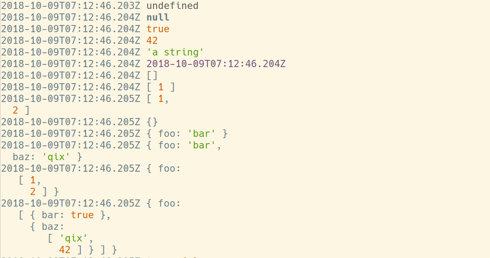

# Q

[](https://standardjs.com)

Q is a better way to do print statement debugging.

Type `q` instead of `console.log` and your variables will be printed like this in `$TMPDIR/q`:



## Why is this better than `console.log`?

* Faster to type
* Pretty-printed vars and expressions
* Easier to see inside objects
* Does not go to noisy-ass stdout. It goes to `$TMPDIR/q`.
* Pretty colors!

## Usage

```js
const q = require("q");
...
q(a, b, c)
```

Then tail the `q` file:

```bash
tail -f $TMPDIR/q

# or, if $TMPDIR is not defined:
tail -f /tmp/q
```

For best results, dedicate a terminal to tailing `$TMPDIR/q` while you work.

## Install

```sh
npm install --global q
```

## Haven't I seen this somewhere before?

Python programmers will recognize this as a Javascript port of the [`q` module by zestyping](https://github.com/zestyping/q).

Go programmers will recognize this as a port of the [`q` module by y0ssar1an](https://github.com/y0ssar1an/q).

Ping does a great job of explaining `q` in his awesome lightning talk from PyCon 2013. Watch it! It's funny :)

[](https://youtu.be/OL3De8BAhME?t=25m14s)

## FAQ

### Why `q`?

It's quick to type.

### Is `q` safe for concurrent use?

Yes.
