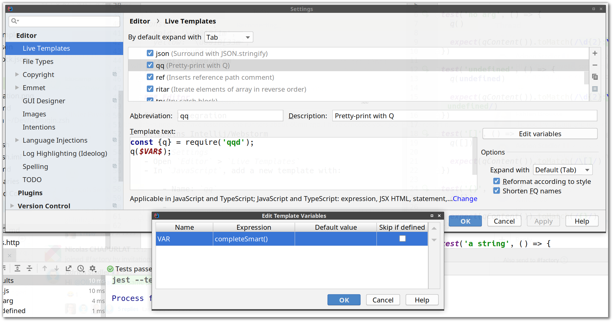

# Q

[](https://circleci.com/gh/tomsquest/q.js)
[](https://www.codacy.com/app/tomsquest/q.js?utm_source=github.com&amp;utm_medium=referral&amp;utm_content=tomsquest/q.js&amp;utm_campaign=Badge_Grade)
[](https://standardjs.com)

**`q`** is a better way to do print statement debugging.

Type `q` instead of `console.log` and your variables will be printed like this in `$TMPDIR/q`:


## Why is this better than `console.log`?

* Faster to type
* Pretty-printed vars and expressions
* Easier to see inside objects
* Does not go to noisy-ass stdout. It goes to `$TMPDIR/q`.
* Pretty colors!

## Install

```sh
npm install --global qqd
```

Tips: `qqd` is for "**Q** is **Q**uick **D**ebugging".

## Usage

```js
const { q } = require("qqd");
...
q(a, b, c)
```

Then tail the `q` file:

```bash
tail -f $TMPDIR/q

# or, if $TMPDIR is not defined:
tail -f /tmp/q
```

For best results, dedicate a terminal to tailing `$TMPDIR/q` while you work.

## Editor integrations

### Jetbrains Intellij and Webstorm

1. In `Settings`
1. Open `Editor` > `Live Templates`
1. In `JavaScript`, add a new template
1. Click on `Define` next to `No applicable contexts yet` and pick `JavaScript and TypeScript`
1. Set:
    - Abbreviation: `qq`
    - Description: `Pretty-print with Q`
    - Template Text: `
    const {q} = require('qqd');
    q($VAR$);`
1. Open `Edit variables` and pick `completeSmart()` in the `Expression` column
1. Press `OK`



## Shell Integration

To quickly open the Q file and clearing it, [these two functions are useful](https://raw.githubusercontent.com/tomsquest/q.plugin.zsh/master/q.plugin.zsh). 

Note that the is also a ZSH Plugin, see below.

### ZSH Plugin for Q

This plugin add the two functions seen above to your shell: https://github.com/tomsquest/q.plugin.zsh

Usage with Zgen:

```bash
if ! zgen saved; then
  ...
  zgen load tomsquest/q.plugin.zsh
```

## Haven't I seen this somewhere before?

**Python** programmers will recognize this as a Javascript port of the [`q` module by zestyping](https://github.com/zestyping/q).

**Go** programmers will recognize this as a port of the [`q` module by y0ssar1an](https://github.com/y0ssar1an/q).

Ping does a great job of explaining `q` in his awesome lightning talk from PyCon 2013. Watch it! It's funny :)

[](https://youtu.be/OL3De8BAhME?t=25m14s)

## FAQ

### Why `q`?

It's quick to type.

### Why `qqd`?

On NPM, the `q`, `dd` and even `qdd` (like 'Quick-and-Dirty Debugging') were already published.  
`qqd` seems to be a good choice, short and meaning **Q** is **Q**uick **D**ebugging.

### Is `q` safe for concurrent use?

Yes.

### Haven't I seen this README somewhere before?

Yes, it is largely inspired by the very good README of the [`q` module by y0ssar1an](https://github.com/y0ssar1an/q).
