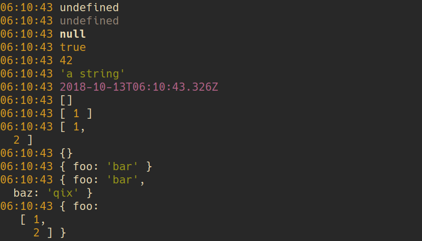
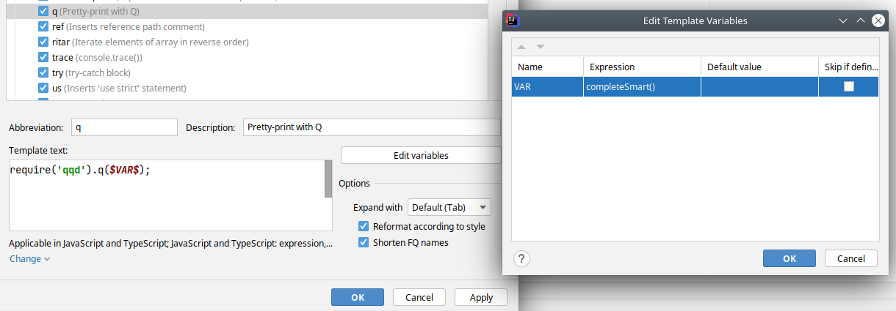
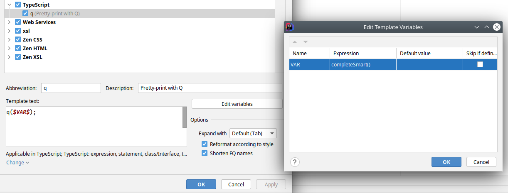
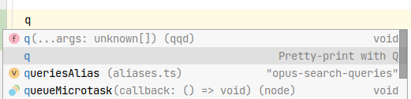

# ⚡ Quick-and-dirty debugging output for tired JS programmers

<div align="center">


</div>

[](https://www.npmjs.com/package/qqd)


## What is Q

> **`q`** is a better way to do print statement debugging.
>
> Type `q` instead of `console.log` and your variables will be printed like this in `$TMPDIR/q`.

## Sample output in `$TMPDIR/q`

<h3 align="center">



</h3>

## Why is this better than `console.log`?

- :zap: Faster to type
- :bento: Pretty-printed vars and expressions
- :mag: Easier to see inside objects
- :see_no_evil: Does not go to noisy-ass stdout. It goes to `$TMPDIR/q`.
- :art: Pretty colors!

Bonus points:

- Provide a type definition for completion in IDE
- Honor [NO_COLOR environment variable](https://no-color.org) to disable coloring

## Changelog

> See [CHANGELOG.md](CHANGELOG.md)

## Install

```sh
npm install qqd
```

Tips: `qqd` is for "**Q** is **Q**uick **D**ebugging".

## Usage

```js
const { q } = require("qqd");
q(a, b, c);

// Or shorter
require("qqd").q(a, b, c);
```

Then tail the `q` file:

```bash
tail -f $TMPDIR/q

# Or if $TMPDIR is not defined:
tail -f /tmp/q
```

For best results, dedicate a terminal to tailing `$TMPDIR/q` while you work, or see below the [Shell integration](#shell-integration).

## Shell Integration

To quickly open the Q file and clearing it, [add this two functions](https://raw.githubusercontent.com/tomsquest/q.plugin.zsh/master/q.plugin.zsh) to your shell.

Note that there is also a ZSH Plugin, [see the instructions below](#zsh-plugin-for-q).

These two functions allows you to quickly tail Q, or to empty the Q file and tail it:

```bash
$ qq
Tailing Q log...
06:14:11 foobar

$ rmqq # File is emptied before
Tailing Q log...
```

### ZSH Plugin for Q

The [ZSH Plugin for Q](https://github.com/tomsquest/q.plugin.zsh) adds the two functions, `qq` and `rmqq`, as seen above to your shell.

Usage with Zgen (or any ZSH plugin manager):

```bash
zgen load tomsquest/q.plugin.zsh
```

Then you can:

```bash
$ qq
Tailing Q log...
06:14:11 foobar

$ rmqq # File is emptied before
Tailing Q log...
```

## Editor integrations

### Jetbrains Intellij and Webstorm

#### For JavaScript:

1. In `Settings`
1. Open `Editor` > `Live Templates`
1. In `JavaScript`, add a new template
1. Click on `Define` next to `No applicable contexts yet` and pick `JavaScript and TypeScript`
1. Set:
   - Abbreviation: `q`
   - Description: `Pretty-print with Q`
   - Template Text: `q($VAR$);`
1. Open `Edit variables` and pick `completeSmart()` in the `Expression` column
1. Press `OK`



#### For TypeScript:

1. In `Settings`
1. Open `Editor` > `Live Templates`
1. Click on the `+` icon and select > `Template Group` and fill "TypeScript"
1. Go to the newly created group `TypeScript`, add a new template
1. Click on `Define` next to `No applicable contexts yet` and pick `TypeScript`
1. Set:
   - Abbreviation: `q`
   - Description: `Pretty-print with Q`
   - Template Text: `q($VAR$);`
1. Open `Edit variables` and pick `completeSmart()` in the `Expression` column
1. Press `OK`



#### Sample usage

Here, by pressing `q`, I can select the first, or the second option:



## FAQ

### Haven't I seen this somewhere before?

**Python** programmers will recognize this as a Javascript port of the [`q` module by zestyping](https://github.com/zestyping/q).  
**Go** programmers will recognize this as a port of the [`q` module by y0ssar1an](https://github.com/y0ssar1an/q).

Ping does a great job of explaining `q` in his awesome lightning talk from PyCon 2013. Watch it! It's funny :)
[](https://youtu.be/OL3De8BAhME?t=25m14s)

### Why `q`?

Because `q` is quick to type ⚡⚡⚡.

### Why the npm module is called `qqd`?

On NPM, the `q`, `dd` ("dirty debug") and even `qdd` ("quick dirty debug") were already published.  
`qqd` seems to be a good choice, short and meaning **Q** is **Q**uick **D**ebugging.

### Is `q` safe for concurrent use?

Yes. Q uses `fs.writeFileSync()` so the writes are synchronous/blocking.

### What about production?

Q does not do anything if NODE_ENV is `production`.

This is for safety: you do not want Q to write stuff when running in production.

Still, it is advised to prevent shipping any calls to Q before shipping code (like you could to for `console.log`).

### How to prevent calls to Q in production?

With ESLint, add the ["Disallow specific imports (no-restricted-imports)"](https://eslint.org/docs/rules/no-restricted-imports) rules to an existing `.eslintrc.js`:

```
"no-restricted-imports": ["error", "qqd"]
```

Alternative for Node.js, the [ESLint Node plugin]() provides two rules:

- [node/no-restricted-import](https://github.com/mysticatea/eslint-plugin-node/blob/master/docs/rules/no-restricted-import.md)
- [node/no-restricted-require](https://github.com/mysticatea/eslint-plugin-node/blob/master/docs/rules/no-restricted-require.md)

### Haven't I seen this README somewhere before?

Yes, it is largely inspired by the very good README of the [`q` module by y0ssar1an](https://github.com/y0ssar1an/q).
